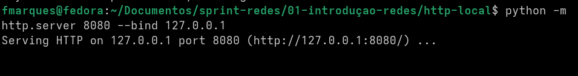
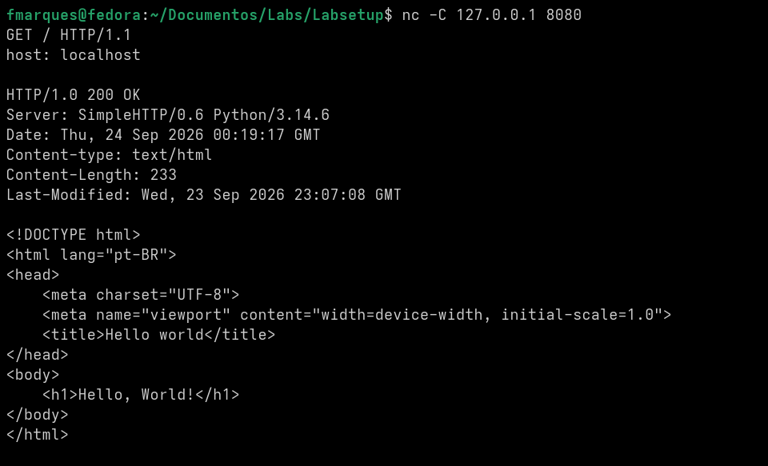
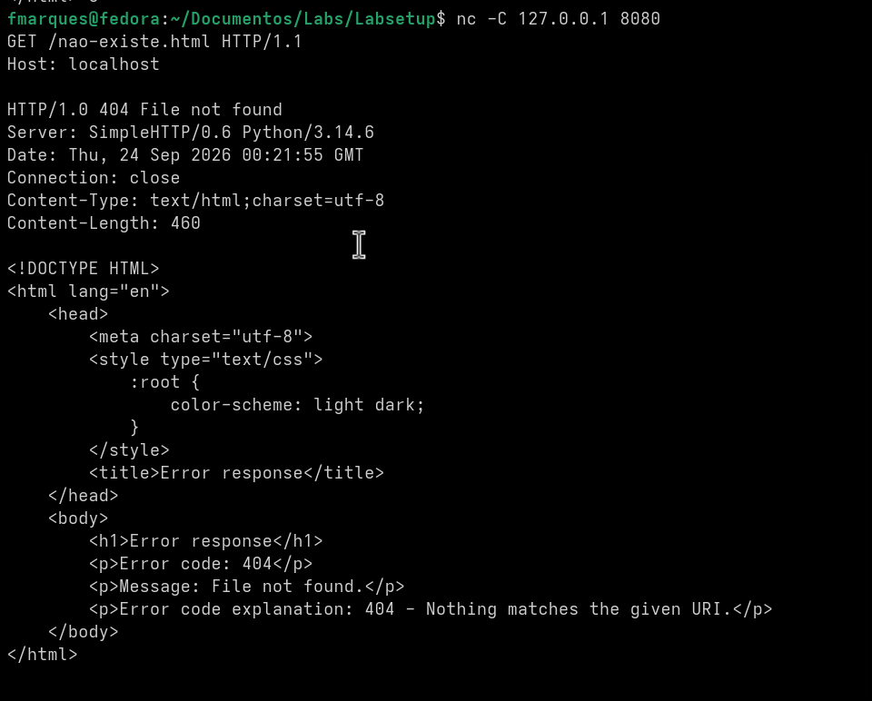
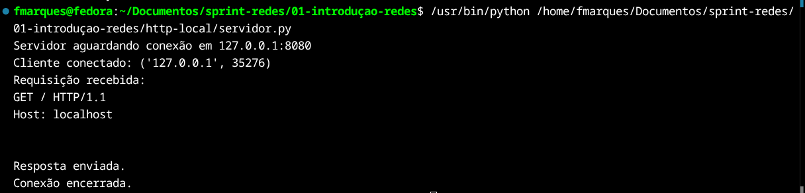
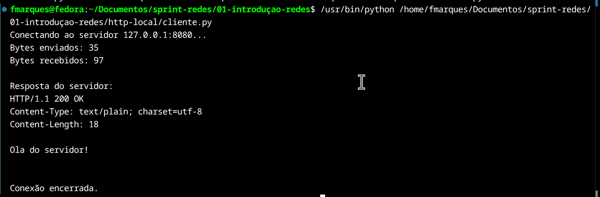

# Exercício — Servidor HTTP local e análise da comunicação

Este documento registra a realização do exercício de servidor HTTP local, requisições HTTP manuais, implementação de cliente/servidor com sockets TCP e exercícios de atraso e vazão.

## Parte 1 — Servidor HTTP local

### Linguagem utilizada

Foi utilizado **Python**.

### Inicialização do servidor

O servidor HTTP local foi iniciado na porta `8080`, associado ao endereço de loopback `127.0.0.1`:

```bash
python -m http.server 8080 --bind 127.0.0.1
```

### Resultado

Ao acessar `http://127.0.0.1:8080` pelo Firefox, foi exibida a página HTML criada, contendo a mensagem **Hello, World!**.

Identificação dos elementos da comunicação:

- **Cliente:** Firefox.
- **Servidor:** processo Python executando `http.server` no terminal.
- **IP local:** `127.0.0.1`.
- **Porta:** `8080`.

### Evidências

Servidor HTTP em execução:



Página acessada pelo Firefox:


---

## Parte 2 — Requisição HTTP manual com `nc`

Com o servidor ainda em execução, foi aberta uma segunda sessão no terminal para realizar requisições HTTP manualmente com `nc`.

Na execução registrada foi utilizado:

```bash
nc -C 127.0.0.1 8080
```

### Requisição com resposta `200 OK`

A requisição enviada foi:

```http
GET / HTTP/1.1
Host: localhost

```

O servidor respondeu com o status:

```http
HTTP/1.0 200 OK
Server: SimpleHTTP/0.6 Python/3.14.6
Content-type: text/html
Content-Length: 233
```

Em seguida, retornou o conteúdo da página HTML:

```html
<!DOCTYPE html>
<html lang="pt-BR">
<head>
    <meta charset="UTF-8">
    <meta name="viewport" content="width=device-width, initial-scale=1.0">
    <title>Hello world</title>
</head>
<body>
    <h1>Hello, World!</h1>
</body>
</html>
```



### Requisição com resposta `404 File not found`

Foi realizada uma nova requisição para um arquivo inexistente:

```http
GET /nao-existe.html HTTP/1.1
Host: localhost

```

O servidor respondeu:

```http
HTTP/1.0 404 File not found
Server: SimpleHTTP/0.6 Python/3.14.6
Connection: close
Content-Type: text/html;charset=utf-8
Content-Length: 460
```

O código `200 OK` indica que a requisição foi processada e o recurso solicitado foi encontrado. Já o código `404 File not found` indica que a requisição chegou ao servidor, mas o recurso solicitado não existe naquele caminho.



### Função da linha vazia

A linha vazia após os cabeçalhos é necessária para marcar o fim da seção de cabeçalhos HTTP e separar os cabeçalhos do corpo da mensagem. Essa separação faz parte da sintaxe do protocolo HTTP.

---

## Parte 3 — Cliente e servidor com sockets TCP

Foram implementados dois programas em Python: um servidor TCP capaz de receber uma requisição HTTP simples e um cliente TCP capaz de se conectar ao servidor, enviar a requisição e exibir a resposta.

### Servidor

```python
import socket

HOST = "127.0.0.1"
PORT = 8080

servidor = socket.socket(socket.AF_INET, socket.SOCK_STREAM)

servidor.bind((HOST, PORT))
servidor.listen(1)

print(f"Servidor aguardando conexão em {HOST}:{PORT}")

conexao, endereco_cliente = servidor.accept()

print(f"Cliente conectado: {endereco_cliente}")

requisicao = conexao.recv(1024)

print("Requisição recebida:")
print(requisicao.decode())

resposta = (
    "HTTP/1.1 200 OK\r\n"
    "Content-Type: text/plain; charset=utf-8\r\n"
    "Content-Length: 18\r\n"
    "\r\n"
    "Ola do servidor!\n"
)

conexao.sendall(resposta.encode())
print("Resposta enviada.")

conexao.close()
servidor.close()

print("Conexão encerrada.")
```

### Cliente

```python
import socket

HOST = "127.0.0.1"
PORT = 8080

cliente = socket.socket(socket.AF_INET, socket.SOCK_STREAM)

print(f"Conectando ao servidor {HOST}:{PORT}...")
cliente.connect((HOST, PORT))

requisicao = (
    "GET / HTTP/1.1\r\n"
    "Host: localhost\r\n"
    "\r\n"
)

dados_enviados = requisicao.encode()
cliente.sendall(dados_enviados)

print(f"Bytes enviados: {len(dados_enviados)}")

resposta = cliente.recv(4096)

print(f"Bytes recebidos: {len(resposta)}")
print("\nResposta do servidor:")
print(resposta.decode())

cliente.close()
print("\nConexão encerrada.")
```

### Funções principais utilizadas

- `bind()`: associa o socket do servidor a um endereço IP e a uma porta local.
- `listen()`: coloca o socket do servidor em modo de escuta, aguardando conexões.
- `accept()`: aceita uma conexão recebida e retorna um novo socket usado para a comunicação com aquele cliente, além do endereço do cliente.
- `connect()`: usado pelo cliente para iniciar uma conexão TCP com o IP e a porta informados.
- `sendall()`: envia todos os bytes fornecidos pelo socket.
- `recv()`: lê dados recebidos pelo socket, até o limite máximo de bytes informado em cada chamada.

### Evidências

Execução do servidor após a conexão do cliente:



Execução do cliente:



### Observação técnica

Na execução acima, o cabeçalho foi configurado com `Content-Length: 18`. O corpo `Ola do servidor!\n` possui 17 bytes em UTF-8. Em uma implementação mais robusta, o valor de `Content-Length` deve ser calculado a partir do corpo da resposta, evitando divergências entre o cabeçalho e os dados enviados.

---

## Parte 4 — Atraso e vazão

### Exercício 1 — Atraso em dois enlaces

Dados:

- `L = 7,5 Mbits`
- `R = 1,5 Mbits/s`
- `N = 2 enlaces`

O atraso de transmissão em um enlace é:

```text
d_trans = L / R
d_trans = 7,5 / 1,5
d_trans = 5 s
```

Como são dois enlaces e estamos desconsiderando outros atrasos:

```text
d_total = 2 × 5
d_total = 10 s
```

**Resposta:** o atraso total aproximado é **10 segundos**.

### Exercício 2 — Divisão em três pacotes e pipeline

A mensagem de `7,5 Mbits` foi dividida em três pacotes de `2,5 Mbits`.

O atraso de transmissão de cada pacote em um enlace é:

```text
d_trans = 2,5 / 1,5
d_trans ≈ 1,67 s
```

Como há dois enlaces, o primeiro pacote precisa de duas transmissões para chegar ao destino. Enquanto ele percorre o segundo enlace, o pacote seguinte já pode ser transmitido pelo primeiro enlace. Isso cria um **pipeline**.

Para três pacotes e dois enlaces:

```text
(3 + 2 - 1) × 1,67 ≈ 6,68 s
```

**Resposta:** o tempo total é aproximadamente **6,67 s**.

A redução em relação aos 10 segundos ocorre porque as transmissões dos pacotes podem se sobrepor: enquanto um pacote está chegando ao destino pelo segundo enlace, o próximo pode estar chegando ao roteador pelo primeiro enlace.

### Exercício 3 — Vazão e gargalo

Os enlaces possuem as seguintes taxas:

```text
1 Gbps
100 Mbps
10 Mbps
500 Mbps
```

A vazão fim a fim é limitada pelo enlace de menor capacidade:

```text
Throughput = min(1 Gbps, 100 Mbps, 10 Mbps, 500 Mbps)
Throughput = 10 Mbps
```

**Resposta:** a vazão fim a fim é **10 Mbps**, e o gargalo é o enlace de **10 Mbps**.

### Exercício 4 — Atraso de transmissão

Dados:

- `R = 100 Mbps`
- `L = 10 Mbits`

```text
d_trans = L / R
d_trans = 10 / 100
d_trans = 0,1 s
```

**Resposta:** o atraso de transmissão é **0,1 segundo**, ou **100 ms**.

### Exercício 5 — Atraso de propagação

Dados:

- distância = `1000 km = 1.000.000 m = 10^6 m`
- velocidade de propagação = `2 × 10^8 m/s`

```text
d_prop = d / s
d_prop = 10^6 / (2 × 10^8)
d_prop = 5 × 10^-3 s
```

Logo:

```text
5 × 10^-3 s = 0,005 s = 5 ms
```

**Resposta:** o atraso de propagação é **5 ms**.

### Exercício 6 — Quando cada tipo de atraso domina

Um exemplo em que o **atraso de transmissão** domina ocorre quando um pacote grande precisa ser enviado por um enlace de baixa taxa de transmissão. Por exemplo, se a rede possui enlaces rápidos, mas em determinado ponto existe um enlace de apenas `20 Mbps`, o tempo necessário para colocar todos os bits do pacote nesse enlace aumenta.

Já o **atraso de propagação** domina quando a distância física é muito grande. Por exemplo, ao acessar um servidor localizado na Europa a partir do Brasil, os sinais precisam percorrer milhares de quilômetros. Mesmo viajando muito rapidamente pela fibra óptica, existe um atraso causado pela distância, algo perceptível em aplicações sensíveis à latência, como jogos online.
