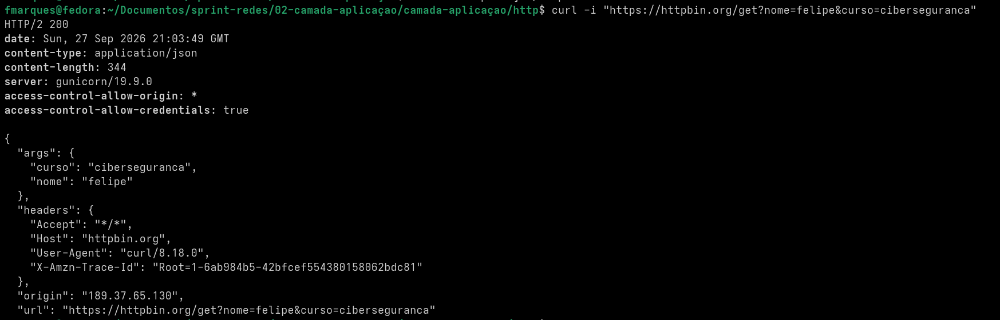
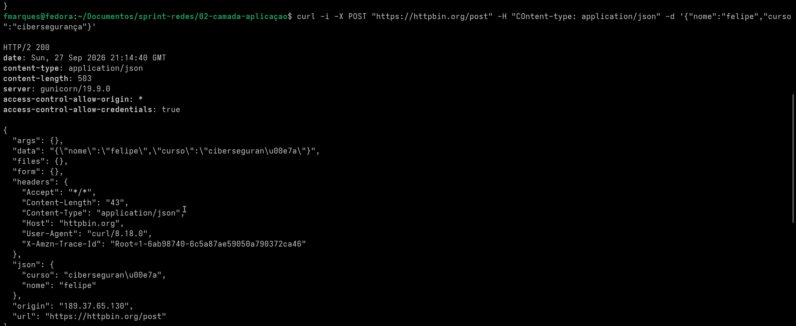
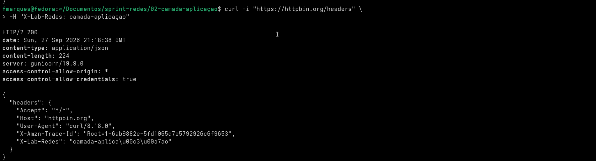
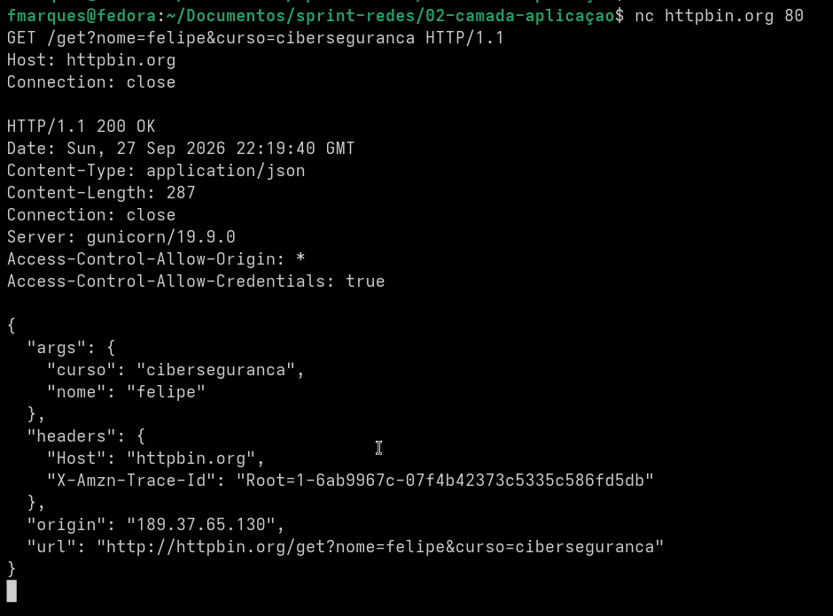
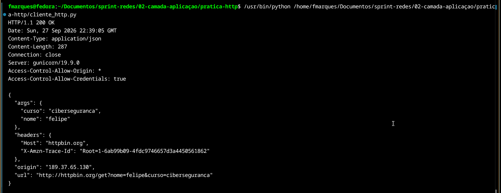

# Relatório — HTTP

## Objetivo

Praticar conceitos fundamentais de HTTP na camada de aplicação, observando requisições e respostas reais e relacionando o protocolo HTTP ao serviço de transporte fornecido pelo TCP.

---

## 1. Requisição GET e query string

Foi realizada uma requisição `GET` para o httpbin com dois parâmetros na própria URL:

```bash
curl -i "https://httpbin.org/get?nome=felipe&curso=ciberseguranca"
```

A resposta retornou sucesso e o servidor refletiu os parâmetros recebidos no objeto `args`.

A prática permitiu observar que a **query string** vem após `?` e que diferentes parâmetros podem ser separados por `&`.

### Evidência



---

## 2. Requisição POST com corpo JSON

Foi enviada uma requisição `POST` para `/post` com o cabeçalho:

```http
Content-Type: application/json
```

e o corpo:

```json
{"nome":"felipe","curso":"ciberseguranca"}
```

Comando utilizado:

```bash
curl -i -X POST "https://httpbin.org/post" \
  -H "Content-Type: application/json" \
  -d '{"nome":"felipe","curso":"ciberseguranca"}'
```

Na resposta, o campo `args` permaneceu vazio enquanto os valores enviados apareceram em `json`. Isso evidencia a diferença entre parâmetros colocados na URL e dados enviados no corpo da requisição.

### Evidência



---

## 3. Cabeçalho HTTP customizado

Foi enviado um cabeçalho adicional:

```http
X-Lab-Redes: camada-aplicacao
```

Comando:

```bash
curl -i "https://httpbin.org/headers" \
  -H "X-Lab-Redes: camada-aplicacao"
```

O servidor refletiu esse cabeçalho na resposta, comprovando que cabeçalhos HTTP podem transportar metadados associados à mensagem.

### Evidência



---

## 4. HTTP manual sobre TCP

Foi aberta uma conexão TCP diretamente com o servidor Web:

```bash
nc httpbin.org 80
```

Em seguida, foi digitada manualmente uma requisição HTTP/1.1:

```http
GET /get?nome=felipe&curso=ciberseguranca HTTP/1.1
Host: httpbin.org
Connection: close

```

O servidor respondeu com:

```http
HTTP/1.1 200 OK
```

seguido de cabeçalhos e do corpo JSON.

Essa prática evidencia a separação entre as camadas:

- **HTTP** define o formato e o significado da mensagem;
- **TCP** fornece o canal pelo qual os bytes da mensagem são transportados.

### Evidência



---

## 5. Cliente HTTP em Python usando sockets

Foi implementado um cliente HTTP simples usando a biblioteca `socket`, sem biblioteca HTTP de alto nível.

Trecho principal:

```python
with socket.socket(socket.AF_INET, socket.SOCK_STREAM) as cliente:
    cliente.connect((HOST, PORT))
    cliente.sendall(requisicao.encode())

    resposta = b""

    while True:
        dados = cliente.recv(4096)

        if not dados:
            break

        resposta += dados
```

### Interpretação

- `AF_INET` indica uso de IPv4;
- `SOCK_STREAM` cria um socket orientado a fluxo, usado com TCP;
- `connect()` inicia a conexão TCP com o host e a porta informados;
- `encode()` transforma a string da requisição HTTP em bytes;
- `sendall()` envia os bytes pelo socket;
- `recv(4096)` lê até 4096 bytes disponíveis em cada chamada;
- o `while` é necessário porque TCP fornece um fluxo de bytes e uma única chamada a `recv()` não representa necessariamente a resposta HTTP inteira;
- `recv()` retornando `b""` indica que o outro lado fechou a conexão de forma ordenada.

A requisição enviada pelo programa foi:

```http
GET /get?nome=felipe&curso=ciberseguranca HTTP/1.1
Host: httpbin.org
Connection: close

```

A execução retornou `HTTP/1.1 200 OK`, cabeçalhos e o corpo JSON com os parâmetros enviados.

### Evidência



---

## 6. Conceitos consolidados

### GET x POST

`GET` é normalmente usado para obter recursos e pode transportar parâmetros na URL. `POST` normalmente envia dados no corpo da requisição.

### Cabeçalhos x corpo

Os cabeçalhos transportam informações de controle e metadados. O corpo carrega o conteúdo da mensagem quando aplicável.

### HTTP x TCP

O HTTP é um protocolo da **camada de aplicação**. Ele define métodos, caminhos, cabeçalhos, códigos de status e o formato das mensagens.

O TCP pertence à **camada de transporte** e fornece um fluxo de bytes confiável e ordenado entre os processos.

---

## Conclusão

A prática permitiu observar HTTP tanto por ferramentas de alto nível, como `curl`, quanto em nível mais baixo, construindo a mensagem manualmente sobre TCP e implementando um cliente com sockets.

Foram exercitados GET, POST, query string, corpo JSON, cabeçalhos customizados, códigos de resposta e leitura de uma resposta HTTP completa. O exercício também tornou explícita a relação entre HTTP e TCP: HTTP define a semântica da comunicação e TCP transporta os bytes entre cliente e servidor.
