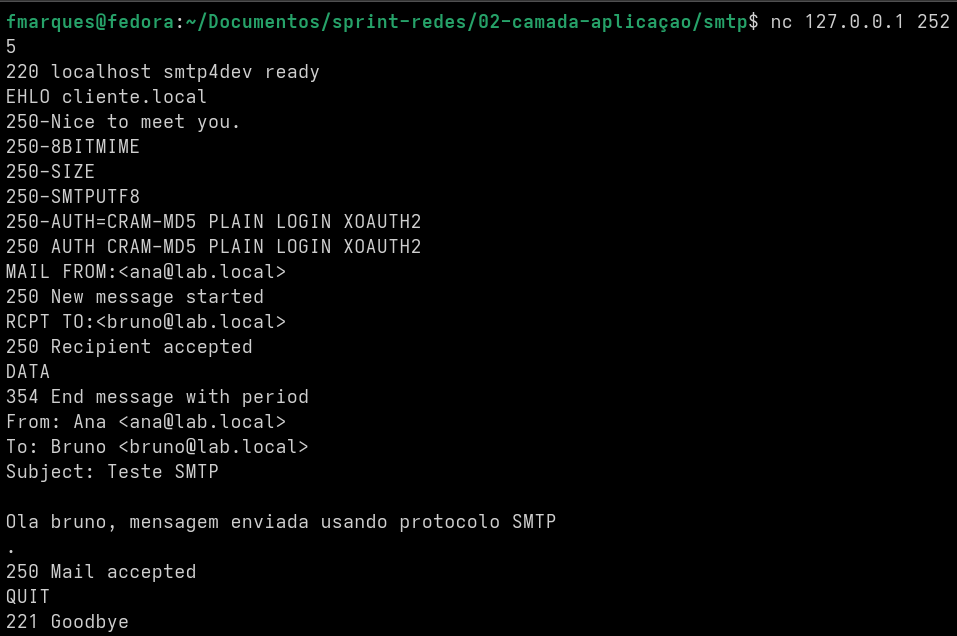
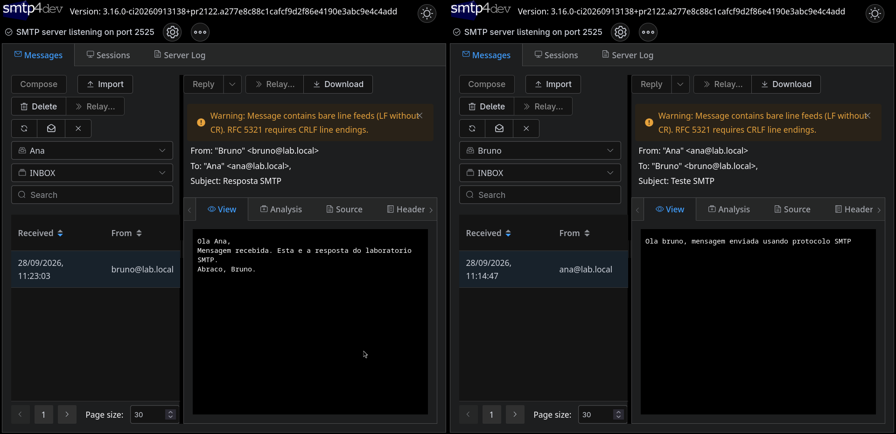

# Relatório — SMTP

## Objetivo

A prática teve como objetivo configurar um servidor SMTP de testes e realizar o envio manual de mensagens, observando os comandos, os códigos de resposta e a diferença entre envelope e cabeçalho.

## Configuração e envio

O smtp4dev foi executado localmente no Fedora, com o painel em `http://localhost:5000`, servidor SMTP na porta `2525` e conexões remotas desativadas. Foram criadas as caixas `Ana` (`ana@lab.local`) e `Bruno` (`bruno@lab.local`).

A conexão foi aberta com `nc 127.0.0.1 2525`. Na sessão foram usados `EHLO`, `MAIL FROM`, `RCPT TO`, `DATA` e `QUIT`. O código `220` indicou que o servidor estava pronto, `250` confirmou comandos aceitos, `354` indicou o início do conteúdo da mensagem e `221` encerrou a conexão.

Foram realizadas mensagens de Ana para Bruno e de Bruno para Ana. O painel confirmou que as duas caixas receberam ao menos uma mensagem.

## Envelope, cabeçalho e segurança

O envelope SMTP é definido por `MAIL FROM` e `RCPT TO`, enquanto `From`, `To` e `Subject` fazem parte dos cabeçalhos da mensagem. Em um teste controlado, o envelope usou `ana@lab.local`, mas o cabeçalho `From` mostrou outro remetente, demonstrando que o SMTP básico não exige que essas informações sejam iguais.

A captura do tráfego mostrou que, sem TLS, comandos e conteúdo podem aparecer em texto legível. Base64 não é criptografia, pois pode ser revertido facilmente. O uso de TLS, junto de mecanismos como SPF, DKIM e DMARC, ajuda a proteger a comunicação e reduzir falsificação de remetente.

Também foi testado MIME com `Content-Type: text/html`, permitindo que o corpo da mensagem fosse interpretado como HTML.
