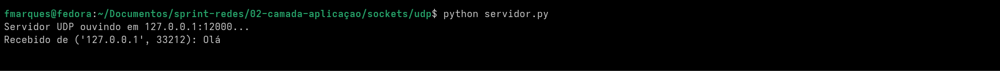
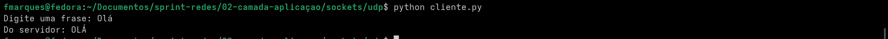
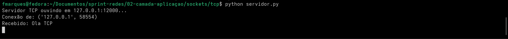
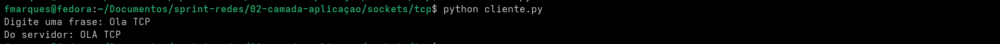
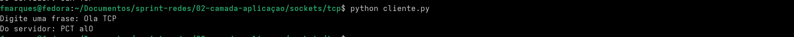
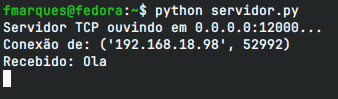
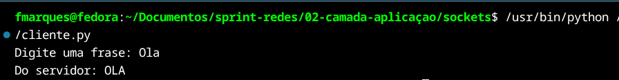
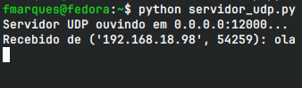
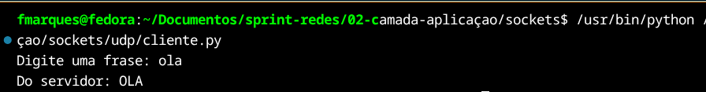

# Relatorio - Sockets TCP e UDP

## Objetivo

A pratica teve como objetivo implementar comunicacao entre cliente e servidor utilizando sockets em Python, primeiro na propria maquina por meio do endereco de loopback e depois entre dois dispositivos diferentes conectados a mesma rede local. Foram utilizados os protocolos UDP e TCP na porta 12000.

## UDP em loopback

O primeiro teste utilizou UDP com o servidor e o cliente executados na mesma maquina. O endereco `127.0.0.1` foi usado para representar o loopback. O cliente enviou a mensagem `Ola` e o servidor recebeu o datagrama, converteu o texto para letras maiusculas e devolveu `OLA`.

No UDP nao existe estabelecimento de conexao antes da troca de dados. O cliente envia um datagrama com `sendto()` e o servidor recebe esse datagrama com `recvfrom()`, que tambem informa o endereco de origem.

## TCP em loopback

Em seguida foi realizado o mesmo tipo de teste com TCP. O servidor ficou escutando em `127.0.0.1:12000` e o cliente estabeleceu uma conexao antes de enviar a mensagem. O servidor recebeu `Ola TCP` e respondeu `OLA TCP`.

No TCP o servidor utiliza `listen()` e `accept()` para aguardar conexoes, enquanto o cliente utiliza `connect()`. Depois que a conexao e estabelecida, os dados sao enviados e recebidos como um fluxo de bytes.

## Modificacao do servidor

Para verificar o entendimento do fluxo de dados, o comportamento do servidor TCP foi alterado temporariamente. Em vez de converter a mensagem para maiusculas, o servidor passou a devolver a string invertida. Ao enviar `Ola TCP`, o cliente recebeu `PCT alO`.

## Comunicacao TCP entre duas maquinas

Depois dos testes locais, o servidor foi executado em um PC e o cliente em um notebook, ambos conectados a mesma rede. O servidor utilizou `0.0.0.0` para aceitar conexoes pelas interfaces de rede da maquina. Durante o teste, o PC servidor estava em `192.168.18.113` e o notebook cliente em `192.168.18.98`.

O servidor registrou uma conexao originada de `192.168.18.98`, recebeu a mensagem `Ola` e devolveu `OLA`. Isso confirmou que a comunicacao ocorreu pela rede local e nao pelo endereco de loopback.

## Comunicacao UDP entre duas maquinas

O teste foi repetido com UDP. O servidor ficou associado a `0.0.0.0:12000` e recebeu um datagrama enviado pelo notebook. O terminal do servidor identificou como origem o endereco `192.168.18.98`, e o cliente recebeu a resposta em letras maiusculas.

## TCP e UDP

A principal diferenca observada na pratica e que o TCP estabelece uma conexao antes da troca de dados e fornece um fluxo de bytes confiavel e ordenado. As fronteiras entre chamadas de envio nao sao preservadas necessariamente nas chamadas de recebimento, portanto uma aplicacao TCP precisa definir como suas mensagens serao delimitadas quando necessario.

O UDP nao estabelece conexao e trabalha com datagramas. Cada envio representa uma mensagem independente, recebida com `recvfrom()`, junto com as informacoes de origem. Em troca dessa simplicidade, o UDP nao oferece as mesmas garantias de entrega e ordenacao do TCP.

## Conclusao

Os testes permitiram implementar e comparar sockets TCP e UDP em Python, observar a comunicacao em loopback, alterar o processamento feito pelo servidor e realizar a troca de dados entre duas maquinas reais da mesma rede. As evidencias mostram o funcionamento do cliente e do servidor nos dois protocolos e confirmam a comunicacao pelos enderecos IP da rede local.
