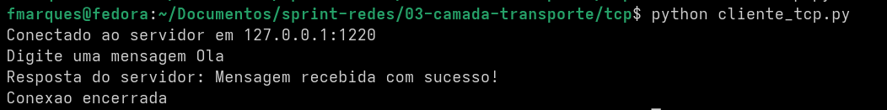
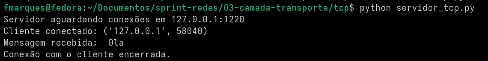
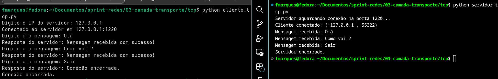
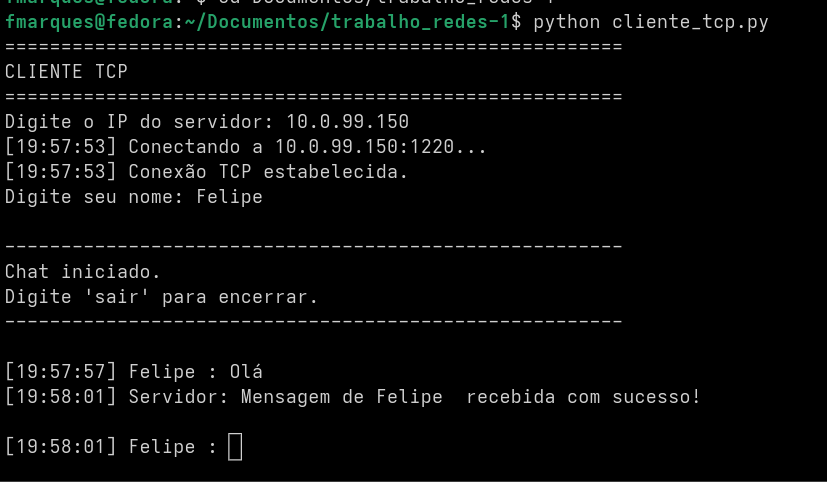
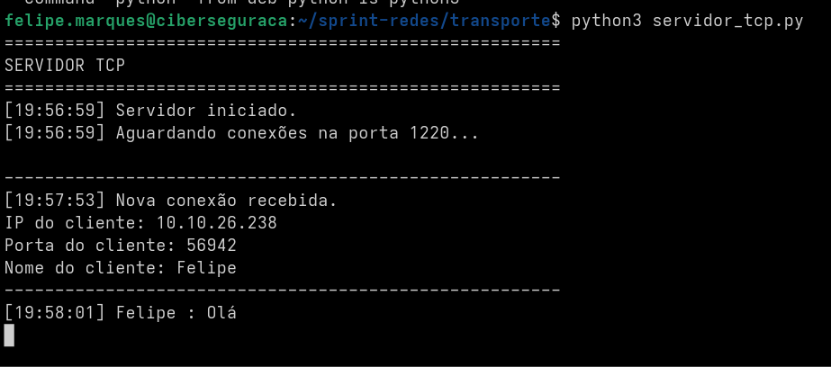

# Camada de Transporte — TCP

## Objetivo

Implementar e testar uma aplicação simples cliente-servidor utilizando **TCP**, com o objetivo de praticar programação com sockets e comprovar uma conexão entre dois computadores.

A aplicação foi desenvolvida em Python e utiliza a porta **1220**, calculada a partir da regra definida para o card. Primeiro foi realizado um teste local utilizando o endereço de loopback `127.0.0.1`. Depois, o servidor foi executado em uma máquina da universidade, permitindo validar a comunicação TCP entre dois computadores diferentes.

## Implementação

A aplicação foi dividida em dois programas:

- **Cliente TCP**: inicia a conexão, permite digitar mensagens e envia os dados ao servidor.
- **Servidor TCP**: aguarda uma conexão, recebe as mensagens e envia uma confirmação ao cliente.

A comunicação utiliza sockets IPv4 orientados a fluxo, criados com `socket.AF_INET` e `socket.SOCK_STREAM`.

A versão final mantém uma única conexão aberta para a troca de várias mensagens. A conexão é encerrada quando o usuário envia `sair`.

## Cliente

O cliente cria um socket TCP e solicita o endereço IP do servidor. Em seguida, executa `connect()` usando o IP informado e a porta `1220`.

Depois que a conexão é estabelecida, o usuário digita mensagens. Como os sockets trabalham com bytes, o texto é convertido com `encode("utf-8")` antes do envio. A transmissão é realizada com `sendall()`.

Após cada envio, o cliente utiliza `recv(1024)` para receber a resposta do servidor e converte os bytes recebidos novamente para texto com `decode("utf-8")`.

Ao encerrar a aplicação, o socket é fechado com `close()`.

## Servidor

O servidor cria um socket TCP, associa-o à porta `1220` com `bind()` e utiliza `listen()` para colocá-lo em estado de escuta.

Na versão preparada para comunicação remota, o servidor utiliza `0.0.0.0` no `bind()`, permitindo que o processo escute conexões destinadas à porta `1220` pelas interfaces IPv4 disponíveis na máquina.

Quando um cliente tenta se conectar, `accept()` retorna um novo socket dedicado àquela conexão e também o endereço do cliente. O socket de escuta continua sendo conceitualmente distinto do socket usado para a troca de dados.

As mensagens são recebidas com `recv(1024)`, decodificadas em UTF-8 e exibidas no terminal. O servidor envia uma confirmação ao cliente com `sendall()`.

## Teste local

O primeiro teste foi realizado na própria máquina utilizando:

- **Servidor:** `127.0.0.1:1220`
- **Cliente:** `127.0.0.1`

O teste confirmou o funcionamento básico da aplicação. O cliente estabeleceu a conexão, enviou mensagens, recebeu respostas e encerrou a sessão corretamente.

Na versão final do teste local, várias mensagens foram transmitidas utilizando a **mesma conexão TCP**. A conexão permaneceu aberta até o envio da palavra `Sair`.

### Evidência — cliente local



### Evidência — servidor local



### Evidência — fluxo local completo



O uso de `127.0.0.1` serviu para validar o código, mas não comprova comunicação entre computadores diferentes, pois esse endereço corresponde à interface de loopback da própria máquina.

## Teste entre máquinas

O teste final foi realizado entre o computador cliente e o servidor da universidade.

### Servidor

- **IP:** `10.0.99.150`
- **Porta:** `1220`

### Cliente observado pelo servidor

- **IP:** `10.10.26.238`
- **Porta efêmera:** `56942`

O cliente iniciou a conexão com `10.0.99.150:1220`. No terminal do servidor foi registrada uma nova conexão originada de `10.10.26.238:56942`.

Em seguida, a mensagem `Olá` foi enviada pelo cliente. O servidor recebeu e exibiu a mensagem e o cliente recebeu a confirmação de sucesso.

Esse teste comprova a comunicação TCP entre **dois computadores diferentes**, atendendo ao requisito prático do card.

### Evidência — cliente remoto



### Evidência — servidor remoto



## Fluxo observado

O fluxo simplificado da aplicação foi:

```text
CLIENTE                                  SERVIDOR

socket()                                 socket()
                                           |
                                           bind()
                                           |
                                           listen()
   |                                       |
connect() -----------------------------> accept()
   |                                       |
sendall() -----------------------------> recv()
   |                                       |
recv()    <----------------------------- sendall()
   |                                       |
close()                                  close()
```

Durante o teste final, a porta `1220` permaneceu fixa no servidor. Já o cliente utilizou uma porta efêmera escolhida pelo sistema operacional.

Uma conexão TCP pode ser identificada pelo conjunto formado por:

- IP de origem;
- porta de origem;
- IP de destino;
- porta de destino.

No teste remoto, a conexão observada foi:

```text
10.10.26.238:56942  <---- TCP ---->  10.0.99.150:1220
```

## Conceitos TCP relacionados

### `socket.socket()`

Cria um socket, isto é, um endpoint que poderá ser utilizado para comunicação de rede.

### `socket.AF_INET`

Indica o uso da família de endereços IPv4.

### `socket.SOCK_STREAM`

Indica um socket orientado a fluxo. Nesta aplicação, ele é utilizado com TCP.

### `bind()`

Associa o socket do servidor a um endereço local e a uma porta.

### `listen()`

Coloca o socket do servidor em estado de escuta para conexões TCP.

### `accept()`

Aguarda uma conexão e retorna um novo socket utilizado para a comunicação com o cliente conectado.

### `connect()`

É utilizado pelo cliente para iniciar a conexão com o endereço IP e a porta do servidor.

### `sendall()`

Envia os bytes fornecidos pelo programa através do socket, continuando o envio até que todos os dados tenham sido entregues ao sistema de sockets ou ocorra um erro.

### `recv(1024)`

Recebe até 1024 bytes disponíveis no fluxo TCP naquela chamada. O valor `1024` não significa que exatamente 1024 bytes serão recebidos.

### `close()`

Encerra o uso do socket pelo programa.

## Evidências

As evidências coletadas durante a prática são:

```text
evidencias/
├── tcp_local_cliente.png
├── tcp_local_servidor.png
├── tcp_local_fluxo_completo.png
├── tcp_remoto_cliente.png
└── tcp_remoto_servidor.png
```

Todas as imagens utilizadas neste relatório foram obtidas durante os testes realizados.

## Conclusão

A aplicação cliente-servidor TCP foi implementada e validada inicialmente em loopback e posteriormente entre duas máquinas diferentes.

O teste remoto demonstrou que o cliente conseguiu estabelecer uma conexão TCP com o servidor `10.0.99.150` na porta `1220`, enviar dados e receber uma resposta. O servidor identificou o endereço e a porta efêmera do cliente e recebeu corretamente a mensagem enviada.

Com isso, o requisito prático de abrir uma conexão TCP com outro computador e realizar troca de dados foi atendido.
